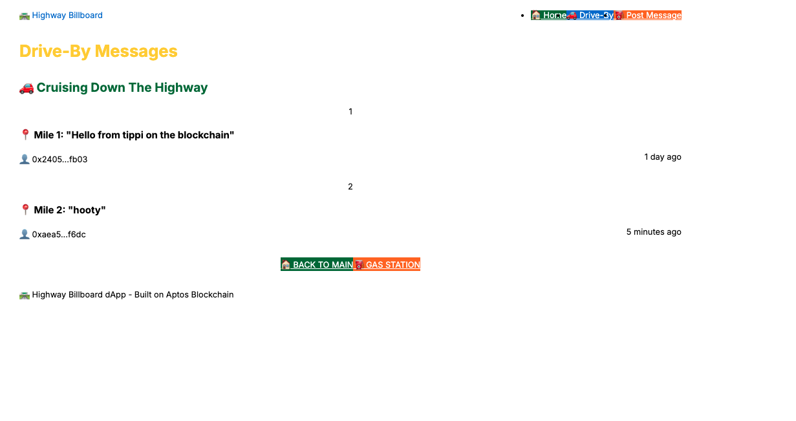

# 🛣️ Highway Billboard dApp

A decentralized billboard application built on the Aptos blockchain where users can post messages to a virtual highway billboard. This project demonstrates how to build a modern web3 application with sponsored transactions using the Aptos Build Gas Station.



## ✨ Features

- **Post Messages**: Users can post messages to the highway billboard
- **Gas Station Integration**: Transactions are sponsored by the Aptos Build Gas Station, so users don't need to pay gas fees (currently not sure if this is working)
- **Wallet Connection**: Seamless integration with Petra wallet
- **Responsive Design**: Highway-themed UI that works on all devices
- **Testnet Support**: Built for the Aptos Testnet

## 🛠️ Technology Stack

- **Frontend**: Next.js, React, TypeScript, Tailwind CSS
- **Blockchain**: Aptos Blockchain (Testnet)
- **Wallet**: Aptos Wallet Adapter with Petra wallet support
- **Smart Contract**: Move module deployed on Aptos Testnet
- **Transaction Sponsorship**: Aptos Build Gas Station

## 🚀 Getting Started

### Prerequisites

- Node.js 18+ and npm/yarn
- [Petra Wallet](https://petra.app/) browser extension installed
- An Aptos Build Gas Station API key

### Environment Setup

1. Clone the repository:

```bash
git clone https://github.com/tippi-fifestarr/highway-billboard.git
cd highway-billboard
```

2. Install dependencies:

```bash
npm install
# or
yarn install
```

3. Copy the `.env.example` file to `.env.local`:

```bash
cp .env.example .env.local
```

4. Edit `.env.local` and add your Aptos Build Gas Station API key:

```
NEXT_PUBLIC_APTOS_API_KEY=your_actual_api_key_here
```

You can obtain an API key from the [Aptos Build dashboard](https://aptoslabs.com/build).

### Running the Development Server

Run the development server:

```bash
npm run dev
# or
yarn dev
```

Open [http://localhost:3000](http://localhost:3000) with your browser to see the application.

## 🔍 How It Works

### Gas Station Integration

The application uses the Aptos Build Gas Station to sponsor transactions, allowing users to post messages without paying gas fees. This is implemented by:

1. Configuring the Aptos client with your API key
2. Using regular transactions that are automatically sponsored by the Gas Station

### Smart Contract Interaction

The dApp interacts with a Move module deployed on the Aptos Testnet. The contract handles:

- Storing messages on the blockchain
- Managing message history
- Ensuring proper access control

### User Flow

1. User connects their Petra wallet to the dApp
2. User writes a message in the form
3. User submits the transaction
4. The Gas Station sponsors the transaction
5. The message appears on the highway billboard

## 🧪 Testing

Make sure your wallet is connected to the Aptos Testnet, as the Gas Station only works on Testnet.

## 📝 License

This project is licensed under the MIT License - see the LICENSE file for details.

## 🤝 Contributing

Contributions are welcome! Please feel free to submit a Pull Request.

## 📞 Contact

If you have any questions or feedback, please open an issue in this repository.
