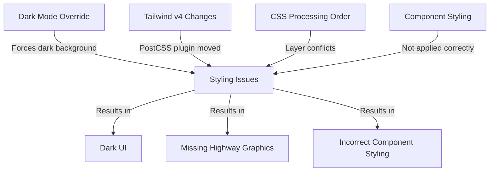
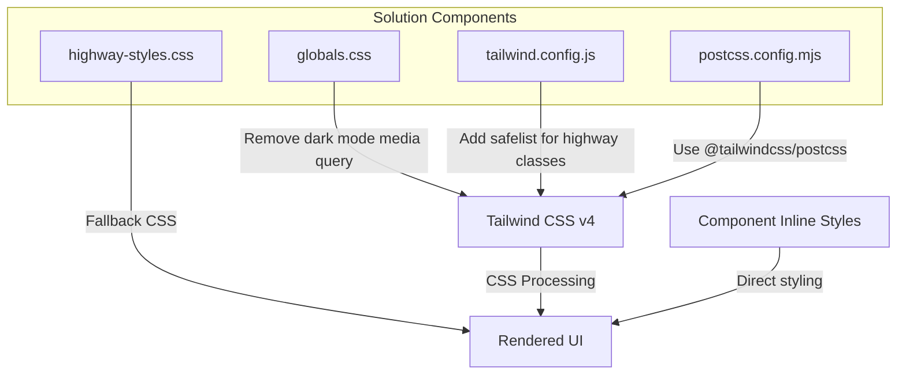
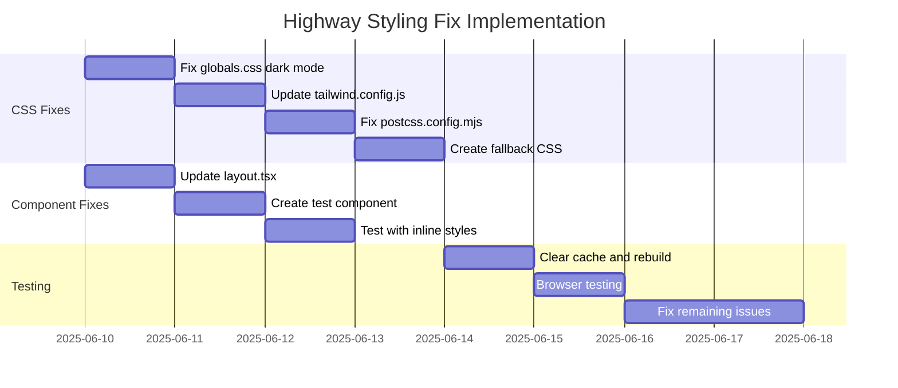
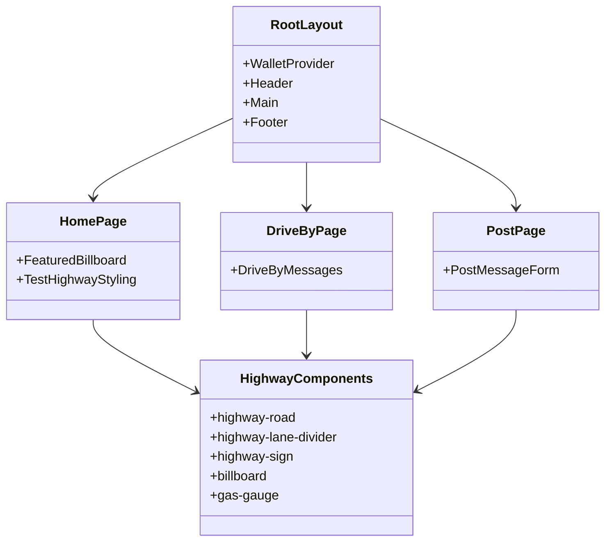
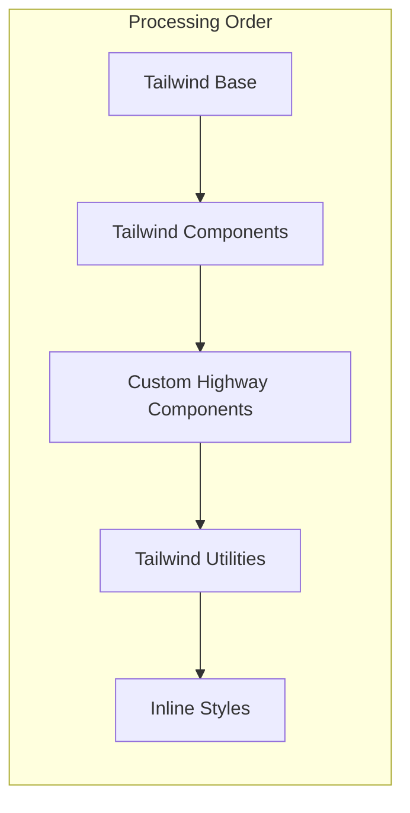

# Highway Billboard Styling Architecture

This document provides visual diagrams to help understand the styling issues and our proposed solutions.

## Current Styling Flow

```mermaid
flowchart TD
    A[globals.css] -->|@tailwind directives| B[Tailwind CSS v4]
    C[tailwind.config.js] -->|Configuration| B
    D[postcss.config.mjs] -->|Plugin config| B
    B -->|CSS Processing| E[Final CSS]
    F[Component Inline Styles] -->|Direct styling| G[Rendered UI]
    E -->|Applied classes| G
    H[prefers-color-scheme: dark] -->|Forces dark mode| G
    
    subgraph "Problem Areas"
        D
        H
    end
```

## Styling Issues Diagnosis



## Proposed Solution Architecture



## Implementation Strategy



## Component Styling Hierarchy



## CSS Processing Flow



## Dark Mode vs Highway Theme

```mermaid
flowchart TD
    A[User Preference] -->|prefers-color-scheme: dark| B{Dark Mode Media Query}
    B -->|Yes| C[Dark Theme Applied]
    B -->|No| D[Light Theme Applied]
    
    E[Highway Theme] -->|Custom Components| F[Highway Styling]
    
    C -->|Conflicts with| F
    D -->|Works with| F
    
    G[Solution] -->|Remove media query| H[Class-based Dark Mode]
    H -->|No conflict with| F